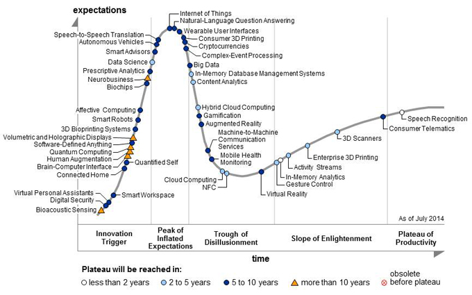
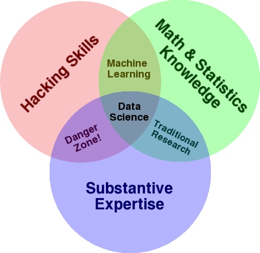

---

# CMSC 498: Introduction

---

## Motivation

- Explosion of data, in pretty much every domain
-- Sensing devices and sensor networks that can monitor everything 24/7 from temperature to pollution to vital signs
    - Increasingly sophisticated smart phones
    - Internet, social networks makes it easy to publish data
    - Scientific experiments and simulations produce astronomical volumes of data
    - Internet of Things
    - [Dataification](http://www.foreignaffairs.com/articles/139104/kenneth-neil-cukier-and-viktor-mayer-schoenberger/the-rise-of-big-data): taking all aspects of life and turning them into data (e.g., what you like/enjoy has been turned into a stream of your "likes")
- How to handle that data? How to extract interesting actionable insights and scientific knowledge?
- Data volumes expected to get much worse

---

## Four V's of Big Data

- Increasing data Volumes 
    - [Scientific data](http://www.wired.com/2014/08/sciences-big-data-problem/): 1.5GB per genome -- can be sequenced in .5 hrs; LHC generates 100TB of data a day
    - 500M tweets per day (as of 2013)
- Variety:
    - Structured data, spreadsheets, photos, videos, natural text, ...
- Velocity
    - Sensors everywhere -- can generate tremenendous volumes of "data streams"
    - Real-time analytics requires data to be consumed as fast as it is generated
- Veracity
    - How do you decide what to trust? How to remove noise? How to fill in missing values?

---

## Big Data and Data Science to the Rescue

- Terms increasingly used synonymously: also data analytics, data mining, business intelligence
    - Loosely used to refer to any process where interesting things are inferred from data
- Data scientist called the sexiest job of the 21st century
    - Everyone is a data scientist now
- Overhyped words

- We are headed toward the Trough of Disillusionment

---

## Is it all hype?

- No
- Extracting insights and knowledge from data very important, and will continue to increase in importance
    - Big data techniques are revolutionizing things in many domains
- But: it is not much different from what we, especially statisticians, have been doing for many years
- What is different?
    - Much more data is digitally available than was before
    - Inexpensive computing + Cloud + Easy-to-use programming frameworks = Much easier to analyze it
    - Often: large-scale data + simple algorithms > small data + complex algorithms
        - Changes how you do analysis dramatically

---

## Some Key Shifts

- From: [Rise of Big Data](http://www.foreignaffairs.com/articles/139104/kenneth-neil-cukier-and-viktor-mayer-schoenberger/the-rise-of-big-data)
1. Curated, clean, small samples --> large, uncurated, messy datasets
    - Statistics based on small, carefully collected random samples 
    - Costly; hard to do fine-grained analysis; careful planning
    - Today: Collect huge volume of data, feed it into algorithms, usually the signal is stong enough to overcome the noise
2. Causation --> Correlation
    - Goal of analysis often to figure out what caused what
    - Causation very hard to figure out
    - Today: give up causation for correlation -- we can find out two things are correlated and often that's enough
3. "Dataification": Process of converting abstract things into concrete data
    - e.g., what you like represented as a stream of your likes; your "sitting posture" captured using 100's of sensors placed in a car seat

---

## Examples

- [Nate Silver and the 2012 Elections](http://fivethirtyeight.blogs.nytimes.com/fivethirtyeights-2012-forecast/)
- [Some reasons why he got things right:](http://blog.revolutionanalytics.com/2012/11/in-the-2012-election-data-science-was-the-winner.html)
    - Many many sources of data, irrespective of quality
    - Incorporation of historical accuracy
    - Understanding correlations
    - Monte-Carlo simulations to compute the probabilities of electoral college

---

## Examples
- [Google Flu Trends](http://www.google.org/flutrends/us/#US)
    - Early warning of flu outbreaks by analyzing search queries
    - Up to 1 or 2 weeks ahead of CDC
    - Analyzed 50M search queries to see which of them fit the physician visits for flu
    - 45 search terms used to create a single model
- Caveat: accuracy not as good any more
    - [NY Times Article](http://bits.blogs.nytimes.com/2014/03/28/google-flu-trends-the-limits-of-big-data/?_php=true&_type=blogs&_r=0)

---

## Defining Data Science

- Very ambiguous and ill-defined term
- [Drew Conway's Venn Diagram](http://drewconway.com/zia/2013/3/26/the-data-science-venn-diagram)
- [Shalizi's viewpoint](http://vserver1.cscs.lsa.umich.edu//~crshalizi/weblog/925.html)

---

## Typical Data Science Workflow

- Source: [Data Science Workflow; Phillip Guo](http://cacm.acm.org/blogs/blog-cacm/169199-data-science-workflow-overview-and-challenges/fulltext)

---

## Where Data Scientist Spends Most Time

- ['Janitor Work' in Data Science](http://www.nytimes.com/2014/08/18/technology/for-big-data-scientists-hurdle-to-insights-is-janitor-work.html); [Research Direction in Data Wrangling](http://vis.stanford.edu/papers/data-wrangling)

---

## What a Data Scientist Should Know

---

## What a Data Scientist Should Know

- From: [how to hire a data scientist](http://mathbabe.org/2011/09/25/why-and-how-to-hire-a-data-scientist-for-your-business/)
- Data grappling skills: how to move data around and manipulate it with some programming langauge
- Data viz experience: how to draw informative pictures of data
- Knowledge of stats, errorbars, confidence intervals
- Experience with forecasting and prediction, both general and specific
- Great communication skills: to communicate the findings

---

## Discussion of the class

- Goals:
    - Introduction to the data science process
    - Learn: 
        - how and why to model data; 
        - how to clean; 
        - tools for storing it; 
        - tools for running analytics on large volumes of data;
        - how to visualize at scale
- Focus on breadth rather than depth

---

## Discussion of the class
- Tools (tentative list, also at [course schedule](http://www.cs.umd.edu/class/fall2014/cmsc498o/schedule.html)):
    - Language: Python, and its libraries (Pandas, Matplotlib), Java (for some assignments)
    - Supporting tools: Git, VirtualBox, AWS Cloud Computing, D3.js 
    - Data Management Tools: Relational databases (PostgreSQL), Data Wrangler, Google OpenRefine, Hadoop, Spark, Cassandra, MongoDB, Storm, Gremlin, Giraph, and a few others
- Step-by-step instructions will be provided to get started for each tool

---

## Grading

- 10 Labs: 40%
    - Individually done
- Midterm + Final: 40%
- Project: 20%
    - Goal to do something interesting using the tools covered in the class on a real dataset
    - Groups of 2
- Will reevaluate based on how initial labs go
- 828 Students: In addition to above,
    - Paper readings and questions about them (20%)
    - Research project instead of the project (30% instead of 20%)
    - Scale accordingly

---

## First Assignment (due in 1 week)

- Github: open an account, and clone class repository
- VirtualBox: download the class VM, and confirm all the installed tools work
- IPython: Basic programming in IPython, and share a notebook

