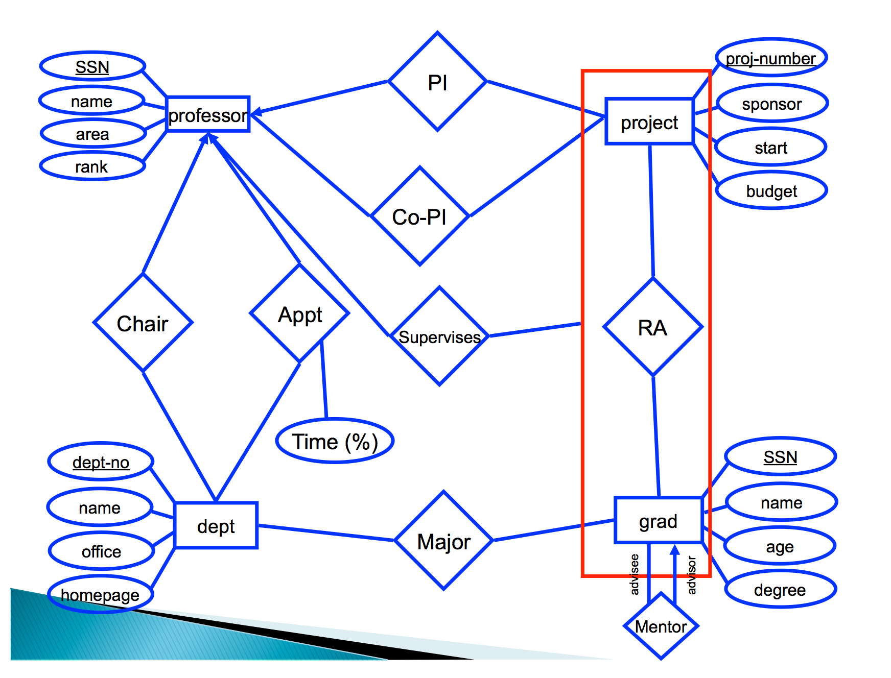

---

# CMSC 498O: Data Modeling

---

## Overview

- Data Modeling
    - Process of representing/capturing the structure in the data
    - **Data model**: A collection of concepts that describes how data is represented and accessed
    - **Schema**: A description of a specific collection of data, using a given data model
- Why?
    - Need to know the structure of the data/information (to some extent) to be able to write general purpose code
    - Lack of a data model makes it difficult to share data across programs, organizations, systems
    - Need to be able to integrate information from multiple sources
    - Efficiency: Can preprocess data to make access efficient (e.g., building a B-Tree on a field)
- A data model typically consists of:
    - Modeling Constructs: A collection of concepts used to represent the structure in the data
        - Typically need to represent types of *entities*, their *attributes*, types of *relationships* between *entities*, and *relationship attributes*
    - Integrity Constraints: Constraints to ensure data integrity (i.e., avoid errors)
    - Manipulation Languages: Constructs for manipulating the data
- We would like it to be:
    - Sufficiently expressive -- can capture real-world data well
    - Easy to use
    - Lends itself to good performance
- The history of modeling can be seen as an attempt to capture the structure in the data.

---

## Overview

- Some examples of data models
    - Relational, Entity-relationship model, XML...
    - Object-oriented, Object-relational, RDF...
    - Current favorites in the industry: JSON, Protocol Buffers, [Avro](http://avro.apache.org/docs/current/), Thrift, Property Graph
- Why so many models ?
    - Tension between descriptive power and ease of use/efficiency
    - More powerful models --> more datasets can be represented
    - More powerful models --> harder to use, to query, and less efficient
- Typically there are multiple levels of modeling
    - Physical modeling concerns itself with how the data is physically stored
    - Logical or Conceptual modeling concerns itself with type of information stored, the different entities, their attributes, and the relationships among those
    - There may be several layers of logical/conceptual models to restrict the information flow (for security and/or ease-of-use)
- **Data independence:** The idea that you can change the representation of data w/o changing programs that operate on it.
- **Physical data independence:** I can change the layout of data on disk and my programs won't change
    - index the data
    - partition/distribute/replicate the data
    - compress the data
    - sort the data

--- 

## Databases: A Brief History

- 1960's: Computers finally become attractive, and enterprises start using it. Most applications initially used their own data stores.
    - **Data base**: coined in military information systems to denote "shared data banks" by multiple applications
        - Each application had its own format
        - Although the data was there, basically unavailable to other programs
            - Often original object code was lost
        - Instead, define a data format, store it as a "data dictionary", and allow general-purpose "data-base management" software to access it
    - Issues:
        - How to write data dictionaries? How to access data?
        - Disadvantages of integration: integrity, security, privacy concerns
        - Who controls the data?
    - Birth of "hierarchical model" and "network model"
        - Both allowed "connecting" records of different types (e.g., connect "accounts" with "customers")
        - Network model attempted to be very general and flexible
            - Charlie Bachman received Turing Award 
        - IBM designed its IMS hierarchical database in 1966 for the Apollo space program; still around today
            - *.. more than 95 percent of the top Fortune 1000 companies use IMS to process more than 50 billion transactions a day and manage 15 million gigabytes of critical business data* (from IBM Website on IMS)
        - Predates *hard disks*
        - However, both models exposed too much of the internal data structures/pointers etc to the users

- 1970's: Relational Model
    - Origins in Set Theory
        - Some early work by D.L.Childs (somewhat forgotten)
        - Edgar F. "Ted" Codd: Developed the relational model
    - Elegant, formal model that provided almost complete *data independence*
        - Users didn't need to worry about how the data was stored, processed etc.
        - High level query language (relational algebra)
    - Notion of *normal forms*
        - Allowed one to reason about and remove redundancies
    - Led to two influential projects: INGRES (UC Berkeley), System R (IBM)
        - Also paved the way for a 1977 startup called "Software Development Laboratories"
        - Didn't care about IMS/IDMS compatibility (as IBM had to)
    - Many debates in the early 70's between Relational Model proponents and Network Model proponents
    - Don Chamberlin of IBM was an early CODASYL advocate (later co-invented SQL)
        - *He (Codd) gave a seminar and a lot of us went to listen to him. This was as I say a revelation for me because Codd had a bunch of queries that were fairly complicated queries and since I'd been studying CODASYL, I could imagine how those queries would have been represented in CODASYL by programs that were five pages long that would navigate through this labyrinth of pointers and stuff. Codd would sort of write them down as one-liners. These would be queries like, "Find the employees who earn more than their managers." [laughter] He just whacked them out and you could sort of read them, and they weren't complicated at all, and I said, "Wow." This was kind of a conversion experience for me, that I understood what the relational thing was about after that.*

- 1976: Peter Chen proposed "Entity-Relationship Model"
    - Allowed higher-level, conceptual modeling; easier for humans to think about
    - Example

        

- 1980: Commercialization/wide-spread acceptance of relational model
    - SQL emerged as a standard, in large part because of IBM's backing
        - People still sometimes complain about its limitations

- Late 80's: Object-oriented, object-relational databases
    - Enriching the expressive power of relational model
        - Set-valued attributes, aggregation, generalization,e tc.
    - Object-oriented: to get around *impedance mismatch* between programming languages and databases
    - Object-relational: allow user-defined types -- gets many benefits of object-oriented while keeping the essence of relational model
        - No real differentiation today from pure relational model
    - Other proposals for semantic data models

- Late 90's-today:
    - XML: eXtensible Markup Language 
        - Intended for *semi-structured* data 
        - Flexible schema
        - Example:

                <?xml version="1.0" encoding="UTF-8"?>
                <!-- Edited by XMLSpy -->
                <CATALOG>
                    <CD>
                        <TITLE>Empire Burlesque</TITLE>
                        <ARTIST>Bob Dylan</ARTIST>
                        <COUNTRY>USA</COUNTRY>
                        <COMPANY>Columbia</COMPANY>
                        <PRICE>10.90</PRICE>
                        <YEAR>1985</YEAR>
                    </CD>
                    <CD>
                        <TITLE>Hide your heart</TITLE>
                        <ARTIST>Bonnie Tyler</ARTIST>
                        <COUNTRY>UK</COUNTRY>
                        <COMPANY>CBS Records</COMPANY>
                        <PRICE>9.90</PRICE>
                        <YEAR>1988</YEAR>
                    </CD>
                    ...

    - RDF: Resource Description Framework
        - Originally intended as a "metadata data model"
        - Key construct: a "subject-predicate-object" triple
            - E.g., subject=sky - predicate=has-the-color - object=blue
        - Direct mapping to a labeled, directed multi-graph
        - Typically stored in relational databases, or what are called "triple-stores"
        - But some graph database products out there as well (e.g., DEX)
                         <?xml version="1.0" encoding="utf-8"?>
                         <rdf:RDF xmlns:contact="http://www.w3.org/2000/10/swap/pim/contact#" xmlns:eric="http://www.w3.org/People/EM/contact#"
                         xmlns:rdf="http://www.w3.org/1999/02/22-rdf-syntax-ns#">
                         <rdf:Description rdf:about="http://www.w3.org/People/EM/contact#me">
                         <contact:fullName>Eric Miller</contact:fullName>
                         </rdf:Description>
                         <rdf:Description rdf:about="http://www.w3.org/People/EM/contact#me">
                         <contact:mailbox rdf:resource="mailto:e.miller123(at)example"/>
                         </rdf:Description>
                         <rdf:Description rdf:about="http://www.w3.org/People/EM/contact#me">
                         <contact:personalTitle>Dr.</contact:personalTitle>
                         </rdf:Description>
                         <rdf:Description rdf:about="http://www.w3.org/People/EM/contact#me">
                         <rdf:type rdf:resource="http://www.w3.org/2000/10/swap/pim/contact#Person"/>
                         </rdf:Description>
                         </rdf:RDF>

        

    - JSON: Javascript Object Notation
        - Very similar to XML and seems to be replacing it for many purposes

                    {
                      "firstName": "John",
                      "lastName": "Smith",
                      "isAlive": true,
                      "age": 25,
                      "height_cm": 167.6,
                      "address": {
                        "streetAddress": "21 2nd Street",
                        "city": "New York",
                        "state": "NY",
                        "postalCode": "10021-3100"
                      },
                      "phoneNumbers": [
                        {
                          "type": "home",
                          "number": "212 555-1234"
                        },
                        {
                          "type": "office",
                          "number": "646 555-4567"
                        }
                      ],
                      "children": [],
                      "spouse": null
                    }
    - Property Graph Model
        - Developed for graph databases
        - Basically a edge- and vertex-labeled graph, with properties associated with each edge and vertex
            
        

- Related: Serialization formats
    - Need a way for programs/systems to send data to each other
    - Several recent technologies all based around schemas
    - [Protocol Buffers](https://code.google.com/p/protobuf/): Developed by Google
        - Schema is mostly relational, with support for optional fields and some other constructs
        - Schema specified using a `.proto` file

                    message Person {
                        required int32 id = 1;
                        required string name = 2;
                        optional string email = 3;
                    }
        - Compiled by `protoc` to produce C++, Java, or Python code
        - Programs can be written in any of those languages, e.g., C++:

                    Person person;
                    person.set_id(123);
                    person.set_name("Bob");
                    person.set_email("bob@example.com");
                    fstream out("person.pb", ios::out | ios::binary | ios::trunc);
                    person.SerializeToOstream(&out);
                    out.close();

    - [Avro](http://avro.apache.org/): Richer data structures, JSON-specified schema

                    {
                        "namespace": "example.avro",
                        "type": "record",
                        "name": "User",
                        "fields": [
                                {"name": "name", "type": "string"},
                                {"name": "favorite_number",  "type": ["int", "null"]},
                                {"name": "favorite_color", "type": ["string", "null"]}
                        ]
                    }

     - [Thrift](https://thrift.apache.org/): Developed by Facebook, now Apache project
           - Main goal to support Remote Procedure Calls across languages
