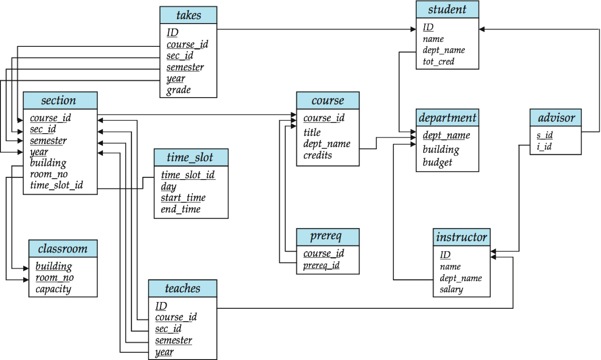
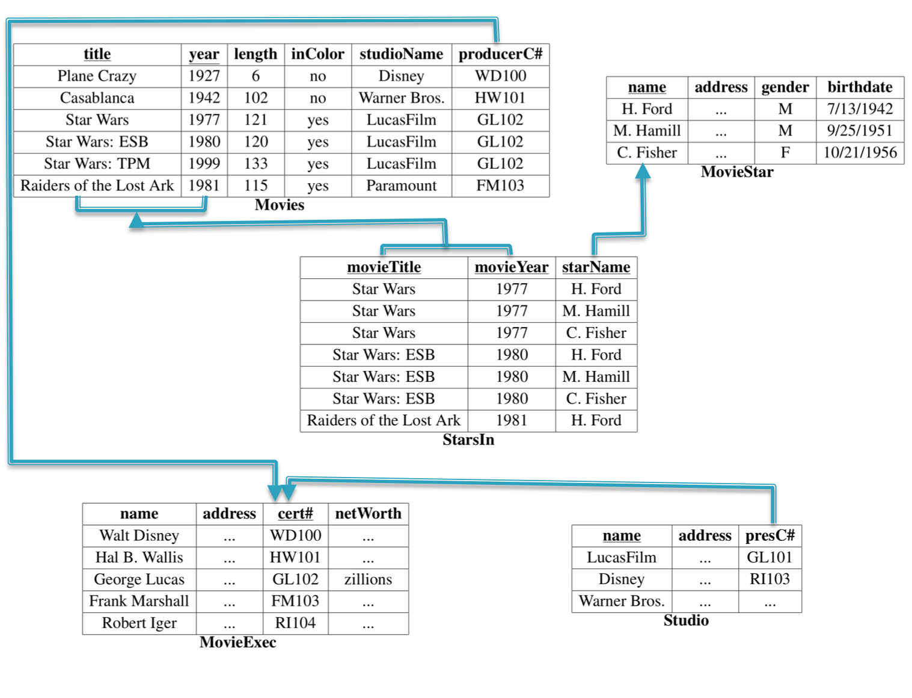

---

# CMSC 498O: Relational Model + SQL

---

## Overview

- Introduced by Ted Codd (late 60's – early 70's)
- Relational data model contributes:
    - Separation of logical, physical data models (data independence)
    - Declarative query languages
    - Formal semantics
    - Query optimization (key to commercial success)
- 1st prototypes:
    - Ingres ->  CA 
    - Postgres -> Illustra ->  Informix -> IBM
    - System R -> Oracle, DB2

---

## Overview

- Key Terms
    - Relations, or Tables
    - Rows, or Tuples, or Records
    - Columns, or Attributes
    - Schema
- Relation Schema
    - A list of attributes and their domain
- Relation Instance
    - A particular instantiation of a relation with actual values
    - Will change over time

---

## Example

--- 

## Keys

- *K* is a **superkey** of *R* if values for *K* are sufficient to identify a unique tuple of each possible relation *r(R)* 
    - Example:  {ID} and {ID,name} are both superkeys of *instructor*
- Superkey *K* is a **candidate key** if *K* is minimal
    - Example:  {ID} is a candidate key for Instructor
- One of the candidate keys is selected to be the **primary key**
    - Typically one that is small and immutable (doesn’t change often)
    - Primary key typically highlighted 
- **Foreign key**: Primary key of a relation that appears in another relation
    - {ID} from *student* appears in *takes, advisor*
    - *student* called referenced relation
    - *takes* is the referencing relation 
    - Typically shown by an arrow from referencing to referenced
- **Foreign key constraint**: the tuple corresponding to that primary key must exist
    - Imagine:
        - Tuple: ('student101', 'CMSC424') in *takes*
        - But no tuple corresponding to 'student101' in *student*
    - Also called referential integrity constraint

--- 

## Keys: Examples

- Married(person1_ssn, person2_ssn, date_married, date_divorced)
- Account(cust_ssn, account_number, cust_name, balance, cust_address)
- RA(student_id, project_id, superviser_id, appt_time, appt_start_date, appt_end_date)
- Person(Name, DOB, Born, Education, Religion, …)
    - Information typically found on Wikipedia Pages
- President(name, start_date, end_date, vice_president, preceded_by, succeeded_by)
    - Info listed on Wikipedia page summary
- Rider(Name, Born, Team_name, Coach, Sponsor, Year)
    - Tour de France: Historical Rider Participation Information  

--- 

## SQL Basics Overview

    - CREATE TABLE <name> ( <field> <domain>, ... )

    - INSERT INTO <name> (<field names>) VALUES (<field values>)

    - DELETE FROM <name> WHERE <condition>

    - UPDATE <name> SET <field name> = <value> WHERE <condition>

    - SELECT <fields> FROM <name> WHERE <condition>

---

## Example Schema for SQL Queries

- Movie(title, year, length, inColor, studioName, producerC#)
- StarsIn(movieTitle, movieYear, starName)
- MovieStar(name, address, gender, birthdate)
- MovieExec(name, address, cert#, netWorth)
- Studio(name, address, presC#)

---

## SQL: Data Definition Language

- CREATE TABLE 
         create table movieExec (
                name char(30), 
                address char(100),
                cert# integer primary key,
                networth integer
         );
         create table movie (
                 title char(100), 
                 year integer, 
                 length integer, 
                 inColor smallint, 
                 studioName char(20), 
                 producerC# integer references 
                 movieExec(cert#)
         );
- Must define movieExec before movie. Why ?

- INSERT INTO <name> (<field names>) VALUES (<field values>)
          insert into StarsIn values('King Kong', 2005, 'Naomi Watts'); 
          insert into StarsIn(starName, movieTitle, movieYear)        values(‘Naomi Watts’, `King Kong’, 2005); 

- DELETE FROM <name> WHERE <condition>
          delete from movies where movieYear < 1980;

   - Syntax is fine, but this command will be rejected. Why ?    

          delete from movies where length < (select avg(length) from movies);
   - Problem:  as we delete tuples, the average length changes
        - Another query: `delete the smallest movie`
   - Solution used in SQL:
       - First, compute avg length and find all tuples to delete
       - Next, delete all tuples found above (without recomputing avg o retesting the tuples)

- UPDATE <name> SET <field name> = <value> WHERE <condition>
    - Increase all movieExec netWorth's over $100,000 by 6%, all other accounts receive 5%.
    - Write two update statements:
                update movieExec set netWorth = netWorth * 1.06 where netWorth > 100000;
                update movieExec set netWorth = netWorth * 1.05 where netWorth < 10000;
    - The order is important
    - Can be done better using the case statement
                update movieExec  
                set netWorth =
                 case 
                    when netWorth > 100000 
                        then netWorth * 1.06
                    when netWorth <= 100000 
                        then netWorth * 1.05
                 end;

---

## SQL Constructs: Single Table Queries

- Movies produced by disney in 1990: note the *rename*
        select m.title, m.year
        from movie m
        where m.studioname = 'disney' and m.year = 1990
    - The **select** clause can contain expressions
            - select title || ' (' || to_char(year) || ')' as titleyear
            - select 2014 - year
    - The **where** clause support a large number of different predicates and combinations thereof
            - year between 1990 and 1995
            - title like 'star wars%'
            - title like 'star wars _'

- Find distinct movies sorted by title
        select distinct title
        From movie
        Where studioname = 'disney' and year = 1990
        order by title;

- Average length of a movie
        select name, avg(length) 
        from movie
        group by year
    - **Group by:** is a very important concept that shows up in many data processing platforms
    - What it does: Partition the tuples by the group attributes (*year* in this case), and do something (*compute avg* in this case) for each group
    - Number of resulting tuples == Number of groups

- Find movie with the maximum length
        select title, year
        from movie
        where movie.length = (select max(length) from movie);
    - The smaller "subquery" is called a "nested subquery"

- Find movies with at least 5 stars: an example of a correlated subquery
        select * 
        from movies m
        where 5 >= (select count(*)
                   from starsIn si
                   where si.title = m.title and si.year = m.year);
    - The "inner" subquery counts the number of actors for that movie.

- Rank movies by their length. 
        select title, year, 
            (select count(*) 
             from movies m2
             where m1.length <= m2.length) as rank
            from movies m1;
    - Key insight: A movie is ranked 5th if there are exactly 4 movies with longer length.
    - Most database systems support some sort of a *rank* keyword for doing this
    - The above query doesn't work in presence of ties etc.

- Set operations
        select name 
        from movieExec
        union/intersect/minus
        select name 
        from movieStar

- Set Comparisons
        select *
        from movies
        where year in [1990, 1995, 2000];

        select *
        from movies
        where year not in (
            select extract(year from birthdate) 
            from MovieStar
        );

---

## SQL Constructs: Multi-table Queries

- Key: 
    - Do a join to get an appropriate table
    - Use the constructs for single-table queries
- You will get used to doing all at once

- Examples:
           select title, year, me.name as producerName 
           from movies m, movieexec me
           where m.producerC# = me.cert#;

- Consider the query:
           select title, year, producerC#, count(starName) 
           from movies, starsIn
           where title = starsIn.movieTitle and year = starsIn.movieYear
           group by title, year, producerC#
     - What about movies with no stars ? 
     - Need to use **outer joins**
           select title, year, producerC#, count(starName) 
           from movies left outer join starsIn
           on title = starsIn.movieTitle and year = starsIn.movieYear
           group by title, year, producerC#

     - All tuples from 'movies' that have no matches in starsIn are included with NULLs
        - So if a tuple (m1, 1990) has no match in starsIn, we get (m1, 1990, NULL) in the result
     - The count(starName) works correctly then.
     - Note: count(*) would not work correctly (NULLs can have unintuitive behavior)
