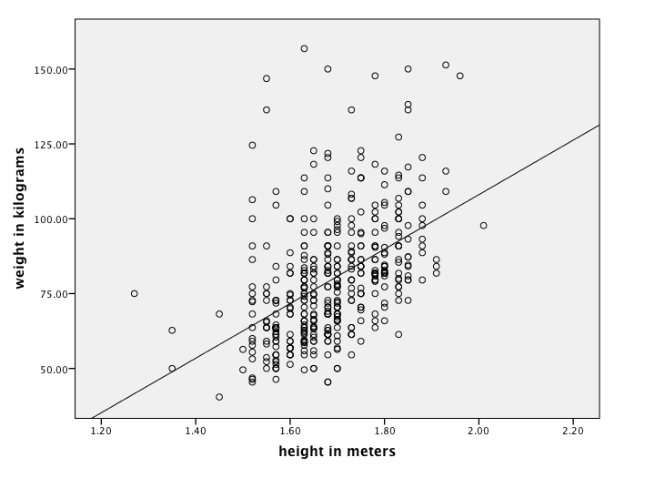
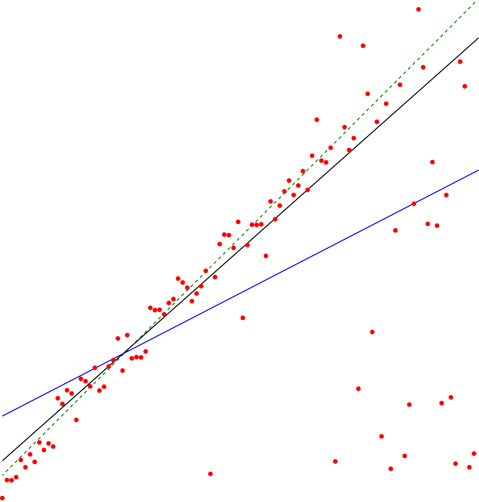
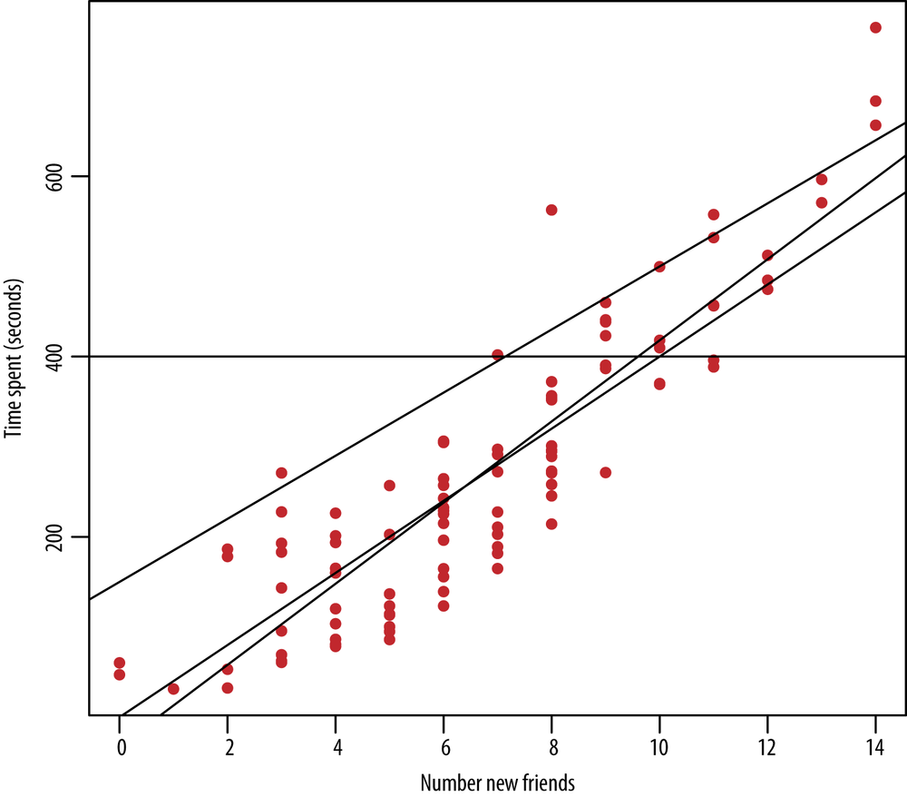
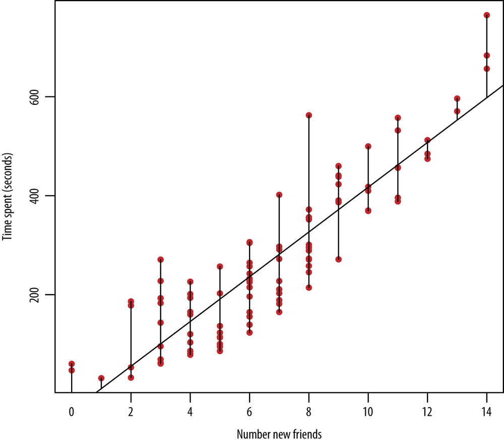
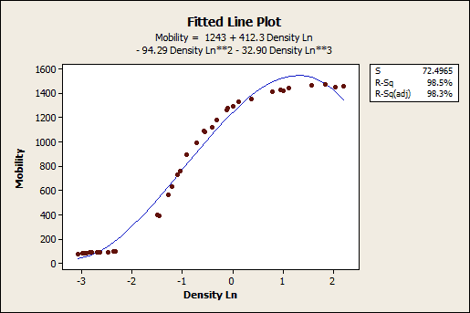
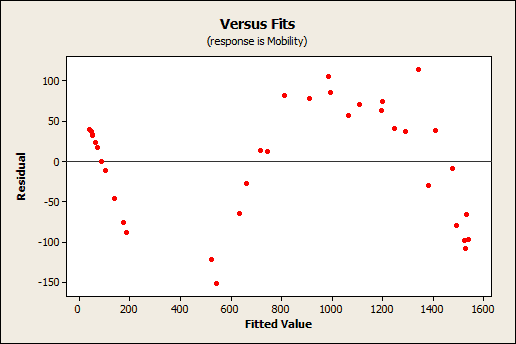
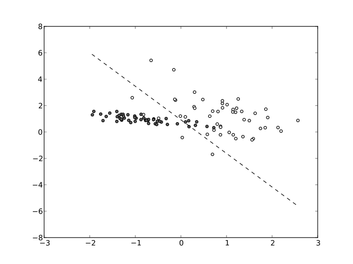
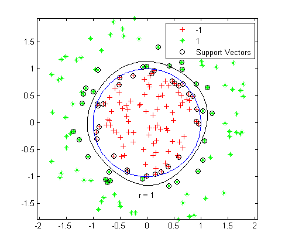

---

# CMSC 498O: Some Basic Stat/ML Algorithms

---

## Some resources

- Wikipedia
- [A tour of ML algorithms](http://machinelearningmastery.com/a-tour-of-machine-learning-algorithms/)
- [Scikit-Learn User Guide](http://scikit-learn.org/stable/user_guide.html)

---

## Overview

- Statistical models vs machine learning algorithms
    - Used somewhat interchangeably
- Goal of ML algorithms is typically to predict, to classify, or to cluster
    - A sample of the data is typically provided to use for *learning* or *modelling*
- Some key terms:
    - **Training vs testing datasets**
        - Use the former to learn, the latter to test the learned model
    - **Supervised vs Unsupervised Learning**
        - In the former, we are provided with additional attributes that we want to predict/classify 
            - Classification: e.g., handwritten digit recognition 
            - Regression: e.g., predicting stock prices
        - In the latter, the goal is to deduce structure in the provided unlabelled data 
            - Clustering: e.g., group customers based on their buying patterns
            - Association rule mining: e.g., if you buy *A*, you are likely to buy *B*
            - Dimensionality reduction: project the data onto a few dimensions to make it simpler to visualize/classify etc.
        - Semi-supervised Learning: a combination of labelled and unlabelled data
    - **Feature Selection**: 
        - Selecting a subset of all possible features to use 
        - Most data contain too many features, most of which are redundant 
    - **Regularization**:
        - Simplifying solutions produced by a technique by penalizing complexity
    - **Overfitting**:
        - Learned model starts capturing the random error or noise instead of the underlying relationship
        - Typically happens when model is too complex (e.g., too many parameters given the data)
- A key challenge for a data scientist: 
    - Choosing which method/algorithm to use for a specific task

---

## Linear Regression

- Goal: to predict the value of a *dependent* (or response, or outcome) variable using one or more *independent* (or explanatory) variables
- Captures the relationship using a linear equation

---

## Linear Regression

- How to find the best fit?
    - Ordinary least squares: minimize the squared distance from the line
    - Ridge regression: add a penalty term for the sizes of the coefficients

---

## Linear Regression

- Goodness of fit: 
    - p-values: Can be used to test the null hypothesis that an independent variable has a significant effect on the dependent variable
        - Does not say anything about goodness-of-fit
    - R2: Ratio of mean squared error and total error
        - Interpreted as: the proportion of variance in the data explained by the model
        - = 1.0 --> perfect fit
        - = 0.0 --> no relationship
    - Use as one tool to assess the goodness of fit, but overreliance (as with most such things) is a bad idea
        - Hard to get good R2 values for many domains (e.g., human behavior)
        - A very good value may still be a bad fit
    - Example from [http://blog.minitab.com](http://blog.minitab.com/blog/adventures-in-statistics/regression-analysis-how-do-i-interpret-r-squared-and-assess-the-goodness-of-fit)
        - Residual plot shows systematic bias -- would prefer to see random noise around the fitted line

--- 

## Linear Regression

- Transformations
    - The *linearity* assumption is only about the parameters
    - We can take arbitrary transformations of the independent variables themselves
    - The following is a linear regression
        - r is the response variable, x, y, z, are the independent variables
        - r = c_1 x^2 + c_2 x + c_3 + c_4 y^3 + c_5 log(z) + c_6 x * y + c_7 x * y^2 * log(z)
- Assumption of independence
    - Things break down if the predictor variables are not independent, or if the errors are not independent

---

## Classification

- One of the most common ML tasks
- Examples: spam vs non-spam emails; diagnostics; high risk vs low risk customers (for loans); ...
- Typical problem setting: 
    - Given a set of features (also called independent variables), and a set of samples (training data) along with labels (dependent variable) for those samples,
    - Learn a model to use for future data points
    - Labels are categorical, not numerical
- For numerical features, visualizing can often suggest how to classify

     

     

---

## Classification: Decision Trees

- Very intuitive and easy-to-use classification models
    - Works for categorical and numerical features
- Many techniques developed for learning them over large volumes of data

---

## Classification: Logistic Regression

- An example of a classification model, not a regression model
- Logistic function: 
    - F(t) = 1/ (1 + e-t)
    - Always between 0 and 1
    - Can be intepreted as a probability
- Say: features are: x, y, and response variable is r which takes two values (true and false)
- Consider the formula:
    - F = 1 / (1 + e-(c_1 x + c_2 y + c_3))
    - Treat it as a probability that the response variable is true or false
- Learning problem: from training data, estimate the coefficients c_i's

---

## Classification: Support Vector Machines
