---

# CMSC 498O: Data Extraction, Integration, and Wrangling

---

## Overview

- Goal: get data into a structured form suitable for analysis
    - Variously called: data preparation, data munging, data curation
    - Also often called ETL (Extract-Transform-Load) process
- Often the step where majority of time (80-90%) is spent
- Key steps:
    - Scraping: extracting information from sources, e.g., webpages, spreadsheets
    - Data transformation: to get it into the right structure
    - Data integration: combine information from multiple sources
    - Information extraction: extracting structured information from unstructured/text sources
    - Data cleaning: remove inconsistencies/errors

    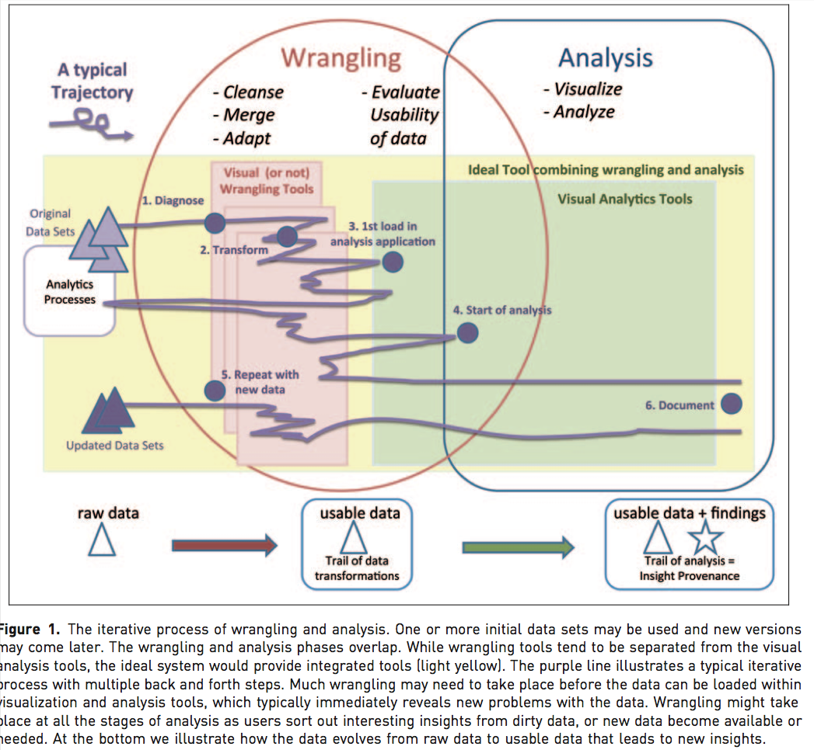

- Many of the problems are not easy to formalize, and have seen little work
    - E.g., Cleaning
    - Others aspects of integration, e.g., schema mapping, have been studied in depth
- Typical workflow
    - From [Data Cleaning:  Problems and Current Approaches](https://www.ki.informatik.hu-berlin.de/mac/lehre/lehrmaterial/Informationsintegration/Rahm00.pdf)
    - Somewhat old: data is mostly coming from structured sources
    - For a data scientist, the data scraping is equally important

    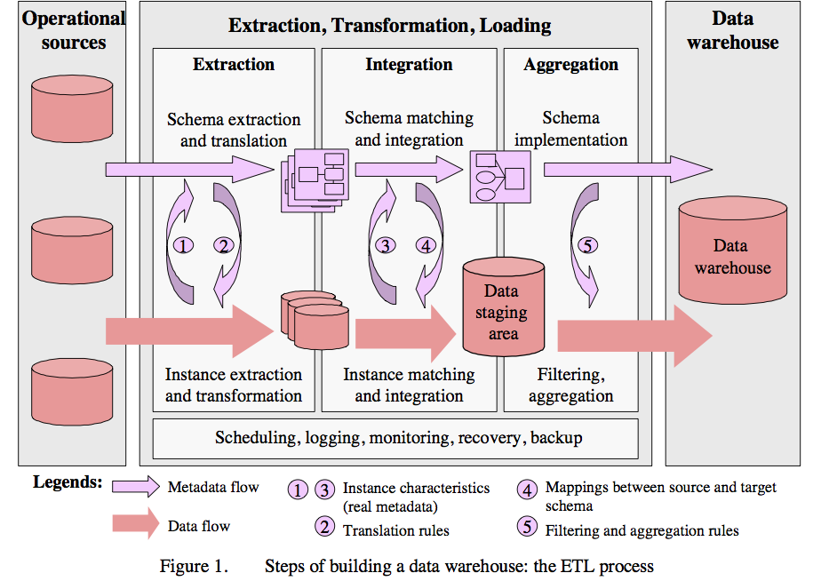

---

## Overview

#### Single-source problems: 
- Depends largely on the source
- Databases can enforce constraints, whereas data extracted from files or spreadsheets, or scraped from webpages is much more messy
- Types of problems:
    - Ill-formatted data, especially from webpages or files or spreadsheets
    - Missing or illegal values, Misspellings, Use of wrong fields, Extraction issues (not easy to separate out different fields)
    - Duplicated records, Contradicting Information, Referential Integrity Violations
    - Unclear default values (e.g., data entry software needs something)
    - Evolving schemas or classification schemes (for categorical attributes)
    - Outliers

#### Multi-source problems:
- Different sources are developed separately, and maintained by different people
- Issue 1: Mapping information across sources (schema mapping/transformation)
    - Naming conflicts: same name used for different objects
    - Structural conflicts: different representations across sources
    - We will cover this later
- Issue 2: Entity Resolution: Matching entities across sources
- Issue 3: Data quality issues
    - Contradicting information, Mismatched information, etc.

    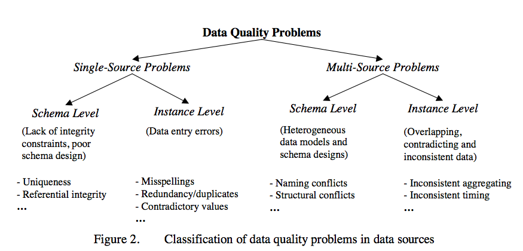

    

    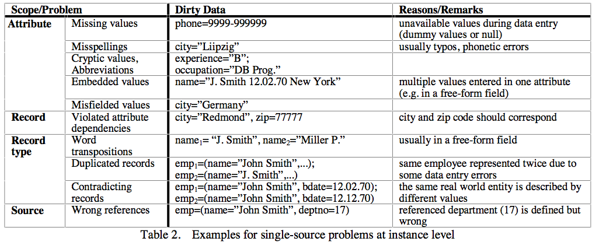

---

## Data Scraping

- Data may reside in a wide variety of different sources, including: CSV files, JSON files, XML, different databases, Spreadsheets, ...
    - Most analytical tools support importing data from such sources
- Web scraping: Scraping data from web sources is tougher
    - In some cases, there may be APIs
    - In most other cases, data may have to be explicitly scraped
    - Often pipelines are set up to do this on a periodic basis
        - Can be fragile
    - Several tools out there to do this automatically
        - E.g., [import.io](https://import.io/), [Kimono](http://www.kimonolabs.com), ...

--- 

## Data Cleaning: Outlier Detection

- From: [Quantitative Data Cleaning for Large Databases; Joe Hellerstein](http://db.cs.berkeley.edu/jmh/papers/cleaning-unece.pdf)
    - Brief discussion of the general problem, but focuses primarily on quantitative data (i.e., integers/floats that measure some quantities of interest)
- Also from: [Outlier Detection: Principles, Techniques, Applications; Chawla and Sun](http://www3.ntu.edu.sg/sce/pakdd2006/tutorial/chawla_tutorial_pakddslides.pdf)

- Sources of errors in data
    - Data Entry Errors: users putting in arbitrary values to satisfy the form especially problematic
    - Measurement Errors: Much data never sees human eyes, especially sensor data; however rife with all kinds of errors
    - Distillation Errors: errors that pop up during processing and summarization
    - Data Integration Errors: inconsistencies across sources that are combined together

- Univariate outliers
    - A set of values can be characterized by metrics such as center (e.g., mean), dispersion (e.g., standard deviation), and skew
    - Can be used to identify outliers
        - Must watch out for "masking": one extreme outlier may alter the metrics sufficiently to mask other outliers
        - Should use **robust statistics**: considers effect of corrupted data values on distributions
        - Robust center metrics: median, k% trimmed mean (discard lowest and highest k% values)
        - Robust dispersion: 
            - Median Absolute Deviation (MAD): median distance of all the values from the median value
    - A reasonable approach to find outliers: any data points 1.4826x MAD away from median
        - The above assumes that data follows a **normal** distribution
        - May need to eyeball the data (e.g., plot a histogram) to decide if this is true
    - [Wikipedia Article on Outliers](http://en.wikipedia.org/wiki/Outlier) lists several other normality-based tests for outliers
    - If data appears to be not normally distributed:
        - Distance-based methods: look for data points that do not have many neighbors
        - Density-based methods:
            - Define *density* to be average distance to *k* nearest neighbors
            - *Relative density* = density of node/average density of its neighbors
            - Use relative density to decide if a node is an outlier
    - Most of these techniques start breaking down as the dimensionality of the data increases
        - *Curse of dimensionality*
        - Can project data into lower-dimensional space and look for outliers there
            - Not as straightforward -- outlier detection 

    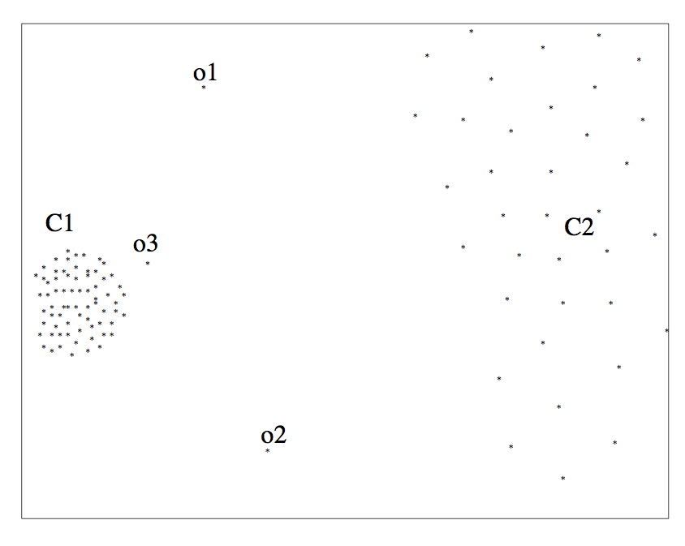

- Multivariate outliers
    - Analogous to above, one set of techniques based on assuming data follows a *multi-variate normal distribution*
        - Defined by a mean, &mu;, and a *covariance matrix*, &Sigma;
        - **Mahalanobis Depth of a point**: Square root of (x - &mu;)'&Sigma;-1(x - &mu;)
        - Measures how far the point x is from the multivariate normal distribution
            - Look for points that are too far away
    - Mean/Covariance are not *robust* -- they are sensitive to outliers
        - Iterative approach: remove points with high Mahalanobis distance, recompute the mean and covariance
        - Several other general approaches discussed the reference above (by Hellerstein)
        - No clear guidelines here -- need to try different techniques based on the data

- Timeseries outliers
    - Often the data is in the form of a timeseries
    - Can use the historical values/patterns in the data to flag outliers
    - Rich literature on *forecasting* in timeseries data

- Frequency-based outliers
    - An item is considered a "heavy hitter" if it is much more frequent than other items
    - In relational tables, can be found using a simple *groupby-count*
    - Often the volume of data may be too much (e.g., internet routers)
        - Approximation techniques often used
        - To be discussed sometime later in the class

- Things generally not as straightforward with other types of data
    - Outlier detection continues to be a major research area

--- 

## Data Cleaning: Entity Resolution

- From: [Entity Resolution Tutorial](http://www.cs.umd.edu/~getoor/Tutorials/ER_VLDB2012.pdf)

- Identify different *manifestations* of the same real world object
    - Also called: identity reconciliation, record linkage, deduplication, fuzzy matching, Object consolidation, Coreference resolution, and several others
   
- Motivating examples
    - Postal addresses
    - Entity recognition in NLP/Information Extraction
    - Identifying companies in financial records
    - Comparison shopping
    - Author disambiguation in citation data
    - Connecting up accounts on online networks
    - Crime/Fraud Detection
    - Census
    - ...

- Important to correctly identify references
    - Often actions taken based on extracted data
    - Cleaning up data by entity resolution can show structure that may not be apparent before

- Challenges
    - Such data is naturally ambiguous (e.g., names, postal addresses)
    - Abbreviations/data truncation
    - Data entry errors, Missing values, Data formatting issues complicate the problem
    - Heterogeneous data from many diverse sources

- No magic bullet here !!
    - Approaches fairly domain-specific
    - Be prepared to do a fair amount of manual work

--- 

## Entity Resolution: Three Slightly Different Problems

- Setup:
    - In the real world, there are some entities (people, addresses, businesses, etc.)
    - We have a large collection of noisy, ambiguous "references" to those entities (also called "mentions")
- **Deduplication**
    - Cluster the records/mentions that correspond to the same entity
    - Potentially choose/construct a cluster representative (requires "Canonicalization")
        - This is in itself a non-trivial task (e.g., averaging may work for numerical attributes, but what about string attributes?)

    

- **Record Linkage**
    - Match records across two different databases (e.g., two social networks, or financial records w/ campain donations)
    - Tyipcally assume that the two databases are fairly clean

    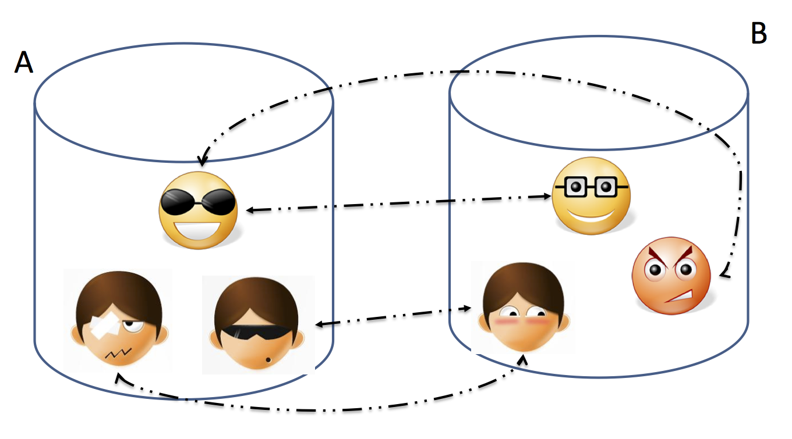

- **Reference Matching**
    - Match "references" to clean records in a reference table
    - Commonly comes up in "entity recognition" (e.g., matching newspaper article mentions to names of people)

    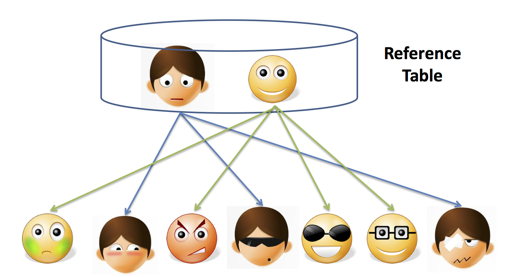

- Somewhat different techniques, but a lot of similarities

--- 

## Entity Resolution: Data Matching

- Comprehensive treatment: Data Matching; P. Christen; 2012 (Springer Books -- not available for free)

- One of the key issues is finding similarities between two references 
    - What similarity function to use?

- Edit Distance Functions 
    - Levenstein: min number of changes to go from one reference to another
        - A change is defined to be: a single character insertion or deletion or substitution
        - May add transposition
    - Many adjustments to the basic idea proposed (e.g., higher weights to changes at the start)
    - Not cheap to compute, especially for millions of pairs

- Set Similarity
    - Some function of intersection size and union size
    - E.g., Jaccard distance = size of intersection/size of union
    - Much faster to compute

- Vector Similarity
    - Cosine similarity

- Q-Grams 
    - Find all length-q substrings in each string
    - Use set/vector similarity on the resulting set

- Several approaches that combine the above (especially q-grams and edit distance, e.g., Jaro-Winkler)

- [Soundex](http://en.wikipedia.org/wiki/Soundex): Phonetic Similarity Metric
    - Homophones should be encoded to the same representation so spelling errors can be handled
    - Robert and Rupert get assigned the same code (R163), but Rubin yields R150

- May need to use Translation Tables
    - To handle abbreviations, nicknames, other synonyms

- Different types of data requires more domain-specific functions
    - E.g., geographical locations, postal addresses
    - Also much work on computing distances between XML documents etc.

--- 

## Entity Resolution: Algorithms

- Simple threshold method
    - If the distance below some number, the two references are assumed to be equal
    - May review borderline matches manually

- Can be generalized to rule-based: 
    - Example from Christen, 2012

    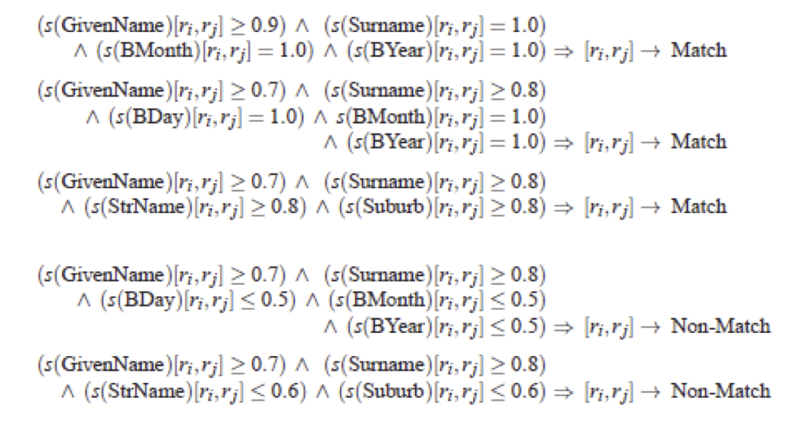

- May want to give more weight to matches involving rarer words
    - More naturally applicable to record linkage problem
    - If two records match on a rare name like "Machanavajjhala", they are likely to be a match
    - Can formalize this as "probabilistic record linkage" (see tutorial slides for more details)

- Constraints: May need to be satisfied, but can also be used to find matches
    - Often have constraints on the matching possibilities
    - Transitivity: M1 and M2 match, and M2 and M3 match, and M1 and M3 must match
    - Exclusivity: M1 and M2 match --> M3 cannot match with M2
    - Other types of constraints:
        - E.g., if two papers match, their venues must match

- Clustering-based ER Techniques:
    - Deduplication is basically a clustering problem
    - Can use clustering algorithms for this purpose
    - But most clusters are very small (in fact of size = 1)
    - Some clustering algorithms are better suited for this, especially Agglomerative Clustering
        - Unlikely K-Means would work here

- Collective Entity Resolution:
    - Do the resolution collectively
    - Much research work on this topic, but pretty domain-specific at this point
    - Example from: Collective ER in Relational Data; Bhattacharya, Getoor.

    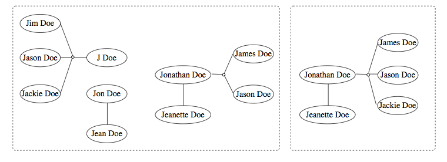

- Crowdsourcing
    - Humans are often better at this task
    - Can use one of the crowdsourcing mechanisms (e.g., Mechanical Turk) for getting human input on the difficult pairs
    - Quite heavily used commercially (e.g., to disambiguate products, restaurants, etc.)

--- 

## Entity Resolution: Scaling to Big Data

- One immediate problem
    - There are N2 possible matches
    - Must reduce the search space 

- Use some easy-to-evaluate criterion to restrict the pairs considered further
    - May lead to false negative (i.e., missed matches) depending on how noisy the data is

- Much work on this problem as well, but domain-specific knowledge likely to be more useful in practice

- One useful technique to know: **min-hash signatures**
    - Can quickly find potentially overlapping sets
    - Turns up to be very useful in many domains (beyond ER)

---

## Data Integration

- Goal: Combine data residing in different sources and provide users with a unified view of these data for querying
    - Each data source has its own schema called **local schemas** (much work assumes relational schemas, but some work on XML as well)
    - The unified schema is often called **mediated schema** or **global schema**

- Two slightly different scenarios

    1. Extract and load all data from the sources, process it, and put it all in a single database (often called *data warehousing*)
        - Relatively easier problem - only need one-way-mappings
        - Query performance predictable and under your control

    1. Keep the data in the sources, but figure out the mappings between them and the mediated schema, and retrieve data from the sources as needed
        - Need two-way mappings -- a query on the mediated schema needs to be translated into queries over data source schemas
        - Not as efficient and clean as data warehousing, but a better fit for dynamic data 
        - Or when data warehousing is not feasible

- Key challenges
    - Data extraction, reconciliation, and cleaning
        - Get the data from each source in a structured form 
        - Often need to use wrappers to extract data from web sources
        - May need to define a schema
    - Schema alignment and mapping
        - Decide on the best mediated schema
        - Figure out mappings and matchings between the local schemas and the global schema
    - Answer queries over the global schema
        - In the second scenario, need to figure out how to map a query on global schema onto queries over local schemas
        - Also need to decide which sources contain relevant data
    - Limitations in mechanisms for accessing sources
        - Many sources have limits on how you can access them
        - Limits on the number of queries you can issues (say 100 per min)
        - Limits on the types of queries (e.g., must enter a zipcode to get information from a web source)

- Example from: Querying Heterogeneous Information Sources; Levy et al.

    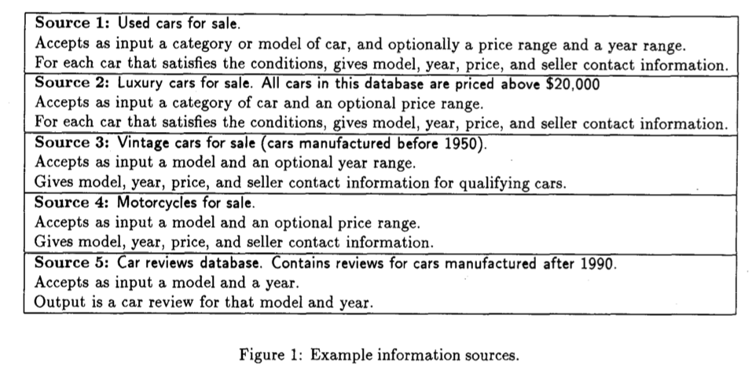

--- 

## Data Integration: Schema Matching or Alignment

- Goal: Identify corresponding elements in two schemas
    - As a first step toward constructing a global schema

- **Ontology alignment** is a closely related problem, but studied in a different domain    
    - Benchmark and yearly evaluation: http://oaei.ontologymatching.org/ 
    - Test cases have 1000's of concepts/terms in the ontologies to be matched

- Example from: Generic Schema Matching with Cupid; Madhavan et al.

    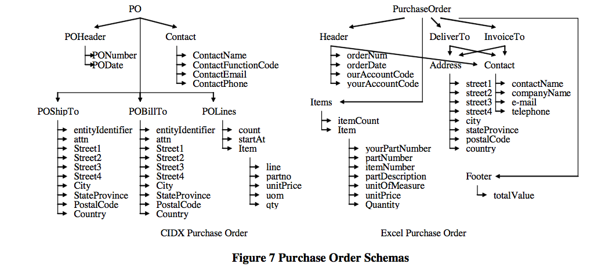

- Techniques:
    - Use names of the attributes, any textual description, and metadata (e.g., data types, constraints)
    - Use structure in the schemas 
    - Overall quite subjective

---

## Data Integration: Schema Mapping

- Two subtly different approaches to maintain mappings between local schemas and global schema
    - For each local schema, specify a transformation to the global schema
    - For each local schema, specify a view on the global schema that it is equal to

- Example: Books
    - S1: Publisher XYZ Website
            Book(ISBN, Title, List_Price, Author_List, Published_Date)

    - S2: Library 
            Books(ISBN, Title, Acquired_Date)
            Authors(ISBN, Name)
            Rented(ISBN, Customer_Name, Rental_Start_Date, Rental_End_Date)

    - S3: Review Website
            Books(Book_ID, Title, Authors)
            Review(Book_ID, Reviewed_By, Review_Text)

    - S4: Old Books Seller (Only books before 1950)
            Book(Title, Price, Published_Year)
            Authors(Title, A_Name)
            
    - Desired Global Schema: 
          Book(ISBN, Title, Edition, Price)
          Author(Author_ID, First_Name, Last_Name)
          BookAuthors(ISBN, Author_ID)
          Publisher(Publisher_ID, Name, Address)
          BookPublishers(ISBN, Publisher_ID)
>>>>>>> f665951dd4bc8bed9703335191c3fa6770d35aa8
